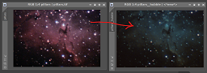
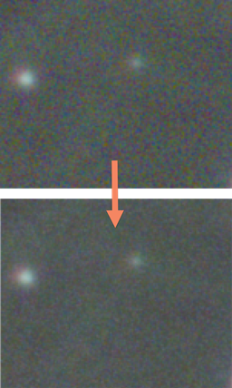

# PixInsight Scripts

This folder contains various script to assist with workflows.

## Scripts

These are the active scripts that are available.

See [release notes](./releases.md) for version details.

|Example (click for full size)|Script (click for documentation and source code)|Description|
|---|---|---|
||[Auto-Linear Fit](./docs/autoLinearFit.md)|A script for normalizing RGB channels.|
||[Fix RGB Pixels](./docs/fixRGBPixels.md)|Removes hot red, green, and blue pixels.|
||[Create Lum Mask](./docs/createLumMask.md)|A quick way to generate a luminance mask from a non-linear image.|
||[Non-Linear Stretch](./docs/nonLinearStretch.md)|Helps tweak contrast by increasing foreground and decreasing background with progressive masks.
|¯\\_(ツ)_/¯|[Generate Decon Support](./docs/generateDeconSupport.md)|Creates the masks I use for deconvolution.|
||[Hubble Palette to RGB](./docs/applyHubbleToRGB.md)|Applies the "Hubble palette" to images.|
||[Deep Denoise](./docs/deepDenoise.md)|Removes noise from linear (non-stretched) images.|

## Installation

The first step is to download the scripts. You can either clone this repository, or [download the latest release](https://github.com/DeepSkyWorkflows/DeepSkyWorkflowScripts/releases).

Once you have the scripts in a folder, for example, `DeepSkyWorkflows`, you can install with the following steps:

1. Open PixInsight
2. Under the `Scripts` tab, choose `Feature Scripts`
   
3. With the dialog that opens, click the `Add` button in the lower left
4. Navigate to and select the folder with the scripts
5. Verify that `DeepSkyWorkflows` has been added
   
6. You're ready to go! It should appear under `Scripts > DeepSkyWorkflows`.

[Back to Main](../README.md)
