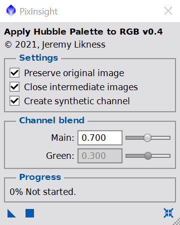
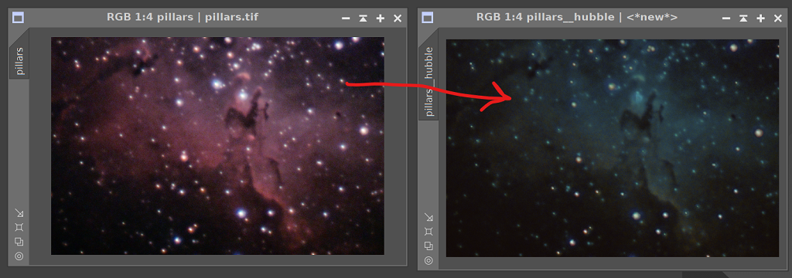

# Deep Sky Workflows

## Apply Hubble to RGB Image

[applyHubbleToRGB.js](../applyHubbleToRGB.js)

This script is intended to transform a traditionally processed (stretched, non-linear) image to use a Hubble-style palette. It is most impactful in nebula with dark structures like M16 (the Eagle Nebula) with its "Pillars of Creation."

[Watch the video demonstration](https://youtu.be/I-9wUgXXokU)

The standard workflow:

1. Use StarNet++ to remove the stars 
2. Normalize RGB channels of the starless image
3. To avoid oversaturating the red channel, create a synthetic channel that subtracts blue from red
4. Normalize the synthetic channel
5. Combine the channels by mixing the synthetic and green channels
   1. Red channel becomes 70% of the synthetic channel combined with 30% of the green channel
   2. Green channel becomes 30% of the synthetic channel combined with 70% of the green channel
   3. Blue channel remains the same
6. Add the stars back

[Back to Scripts](../README.md)
