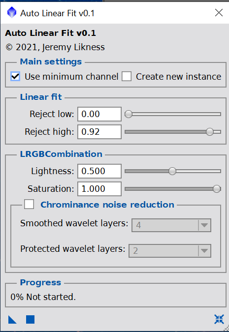
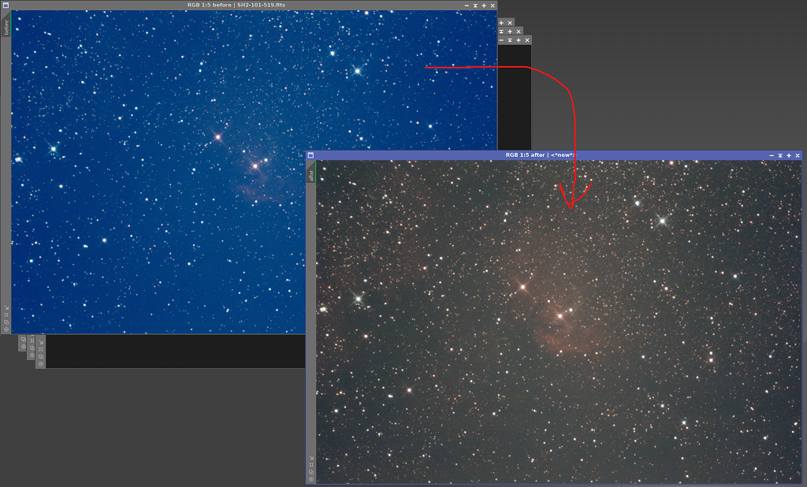

# Deep Sky Workflows

## Auto Linear Fit Script

[autoLinearFitAndCombine.js](../autoLinearFitAndCombine.js)

This script is intended for use on linear (non-stretched) images with skewed RGB channels. If you have to unlink RGB in your Screen Transfer Function (STF) STF, you probably want this. The standard workflow:

1. Split the RGB channels
2. Calculate their median values
3. Choose the channel with the lowest median value
4. Run LinearFit using the reference channel on the other channels
5. Use LRGBCombination to merge the fit channels back into the original image

Parameters allow you to use max instead of min, generate a new image instance, and control noise reduction.

[Back to Scripts](../README.md)