# Deep Sky Workflows

## Deep Denoise

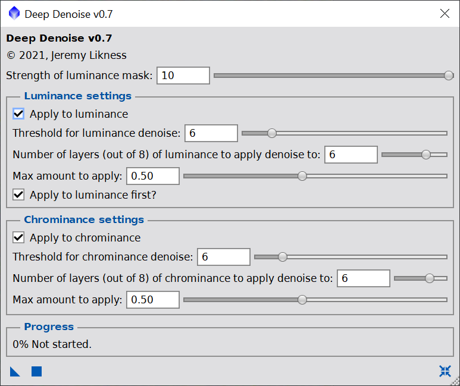

[deepDenoise.js](../deepDenoise.js)

This script is designed to denoise linear (non-stretched) images. It will address the luminance and the chrominance channels. The steps involved are:

1. Create a luminance mask to protect areas of signal.
2. Apply a curves transformation to strengthen or weaken the mask.
3. Apply a multiscale lineaer transformation to the luminance and/or chrominance channels.

Settings:

- **Strength of mask** - a mask is auto-generated to prevent the noise from overpowering your image. If you need more of the image to be exposed to the denoise function, lower this. For stricter protection, increase this.
- **Apply to luminance** - check to apply to the luminance channel.
- **Apply to chrominance** - check to address color noise.
- **Apply luminance first?** - when using both luminance and chrominance, this controls the order they are applied.
- **Threshold** - this is a measure of the structure size that is considered as "noise". Higher values will consider larger structures for noise reduction.
- **Layers** - these are the wavelet layers to apply noise reduction to. 1 = single pixels, 2 = 2x2 pixel squares, up to 8 = 8x8 or 64 pixel sizes.
- **Max amount** - after noise reduction algorithms run, this will apply either the full or a partial amount. Use this in conjunction with the mask to limit the reduction to avoid "plastic" or "fake" looking results.

Here's a close-up example using the defaults:

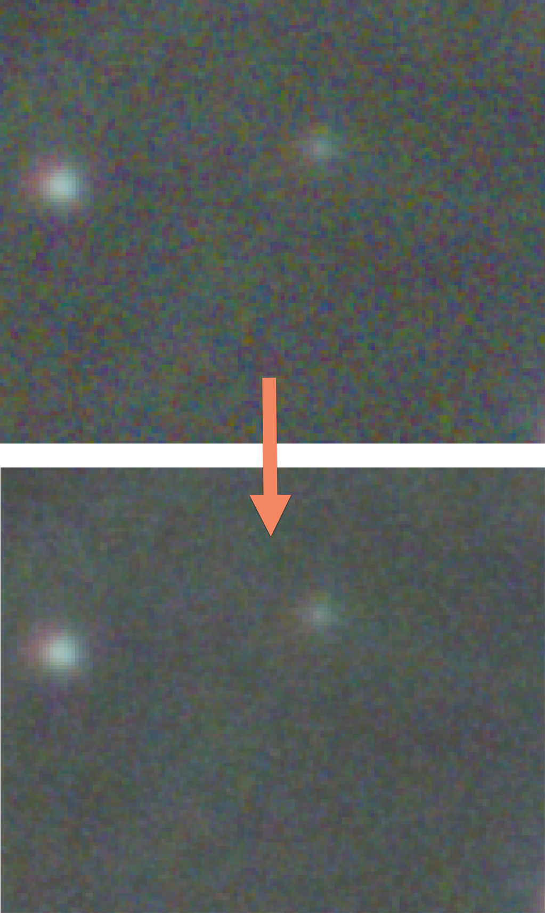

## Examples

These examples are provided to show what's possible and help you decide which settings to tweak.

|Setting|Original|Denoised|
|:--:|:--:|:--:|
|Defaults||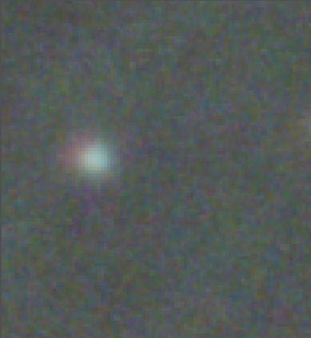|
|Maximum Reduction*||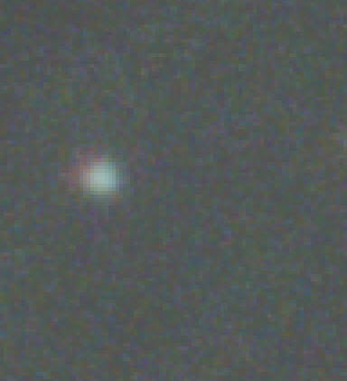|
|Minimum Reduction**||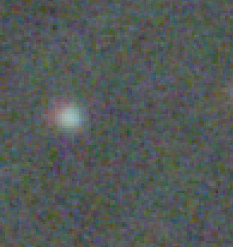|
|Luminance only||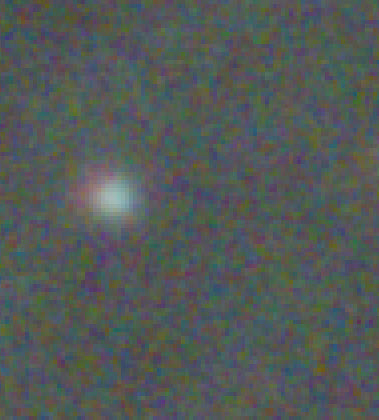|
|Chrominance only||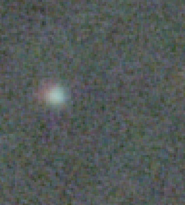|
|Weakest mask||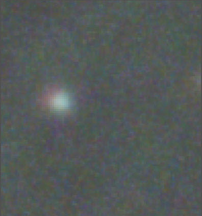|
|Strongest mask||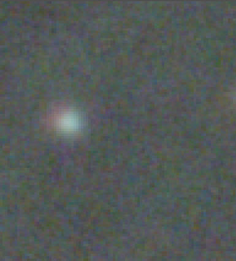|
|Max threshold (40)||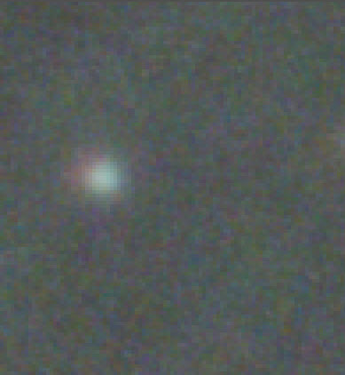|
|Max amount (1.0)||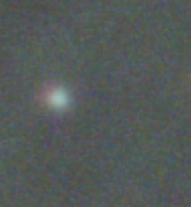|

\* maximum = all sliders to the right
\** minimum = all sliders but layers to the left (layers kept at 6 to show results)

[Back to Scripts](../README.md)