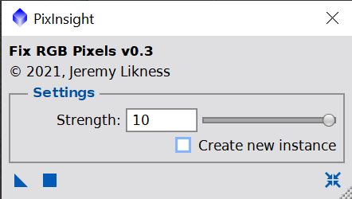
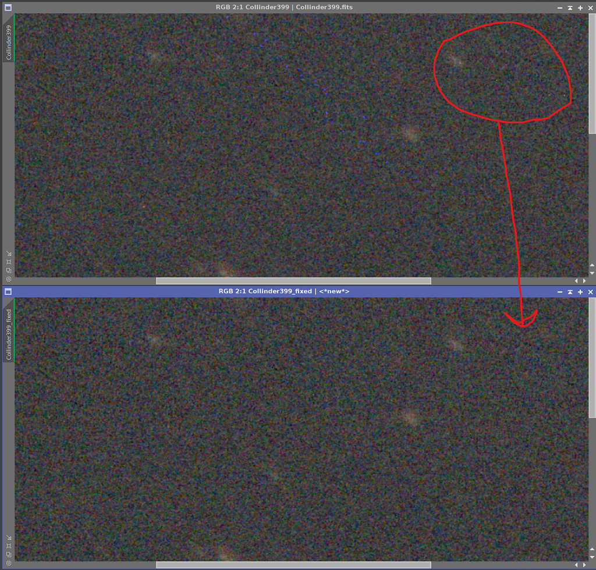

# Deep Sky Workflows

## Fix RGB Pixels

[fixRGBPixels.js](../fixRGBpixels.js)

This script is designed to remove outlying red, green, and blue pixels from linear (unstretched) images. It is a very simple algorithm: when the ratio of one channel exceeds the other channels by a significant factor, it will adjust that channel down. 

- Strength is a continuum from 2:1 to 10:1 (amount of difference required.)
- Given ratio `R` if `C[x]/C[y] > R AND C[x]/C[z] > R)` then `C[x]` is set to `mean(C[y], C[z])`. 

[Back to Scripts](../README.md)