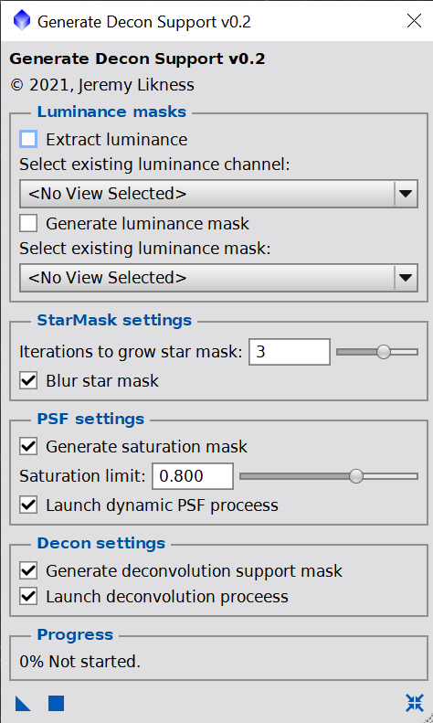

# Deep Sky Workflows

## Generate Decon Support

[generateDeconSupport.js](../generateDeconSupport.js)

This script is intended for use on linear (non-stretched) images. It will create a set of masks to support the deconvolution process.

1. Select "extract luminance" or choose an existing channel.
2. Select "generate luminance mask" or choose an existing mask.
3. Pick the iterations to grow the star mask and whether or not to blur it.
4. The saturation mask helps avoid oversaturated stars for PSF generation. Skip this if you automatically generate your PSF.
5. If you choose "launch dynamic PSF process" the script will apply the saturation mask to the luminance channel, stretch it and then launch the dynamic PSF process so you can click on sample stars and generate your PSF.
6. Choose whether or not to create a deconvolution support mask.
7. If you launch the deconvolution process, the dialog will open with defaults and the deconvolution support mask already set. You just need to provide the point spread function (PSF).

This will generate:

- A **luminance channel** for generating the point spread function (PSF).
- A **luminance mask** that is also used as a template to create other masks.
- A **no stars mask** that contains just the galaxy or nebula with the stars removed. This is useful for highlighting areas of nebulosity to target adjustments like contrast and saturation.
- A **star mask** that can be applied to the main image prior to running deconvolution.
- A **saturation mask** that can be applied to the luminance channel to highlight oversaturated stars.
- A **decon support mask** that contains some of the brighter stars to avoid de-ringing.

[Back to Scripts](../README.md)