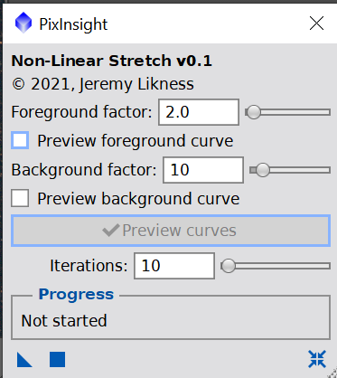
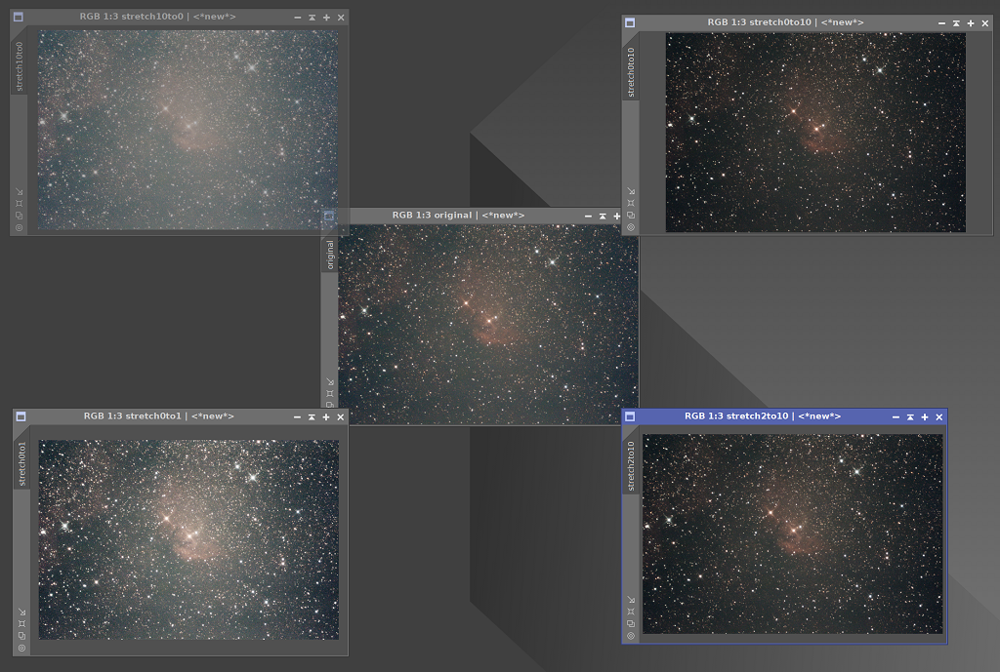

# Deep Sky Workflows

## Non-Linear Stretch

[nonLinearStretch.js](../nonLinearStretch.js)

This script is designed to increase the contrast. It generations a luminance mask, then applies curves transformations to boost the foreground and diminish the background. Set relative weights of the transformations and specify number of iterations. Works best on non-linear (stretched) images.

1. Choose a foreground level (0 to disable, 1 - 100 for intensity).
2. To see the curve, check `Preview foreground` and click the `Preview Curves` button.
3. Choose a background level.
4. Choose the number of iterations.
5. The script will create a mask, apply it, and apply the foreground curve. It will then invert the mask and apply the background curve. It will repeat for the iterations you specify.

> **TIP** try configuring your settings and set iterations to 1. Drag the script onto the workspace to create an icon. You can then drag the icon onto the picture to see the result, and keep dragging it until you achieve the desired result.

[Back to Scripts](../README.md)