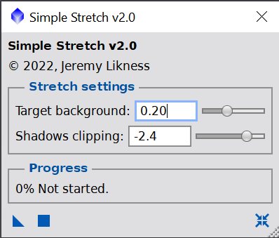
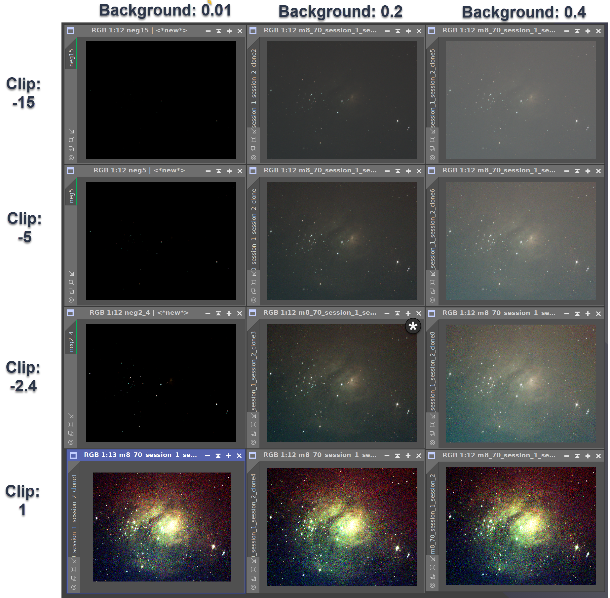

# Deep Sky Workflows

## Simple Stretch

[stretch.js](../stretch.js)

This script performs a simple stretch. With the defaults, it is like performing a default Screen Transfer function followed by a Histogram Transformation. It's less sophisticated than other stretches, but is great for a "quick and dirty" stretch and especially useful for running in scripts (such as preparing frames for a timelapse.)

In general, you set the desired average level for your background and how aggressively you want to clip shadows. The following table demonstrates the effect of different parameters on a raw stack of M8: The Lagoon Nebula. The default settings has an asterisk.

[Back to Scripts](../README.md)